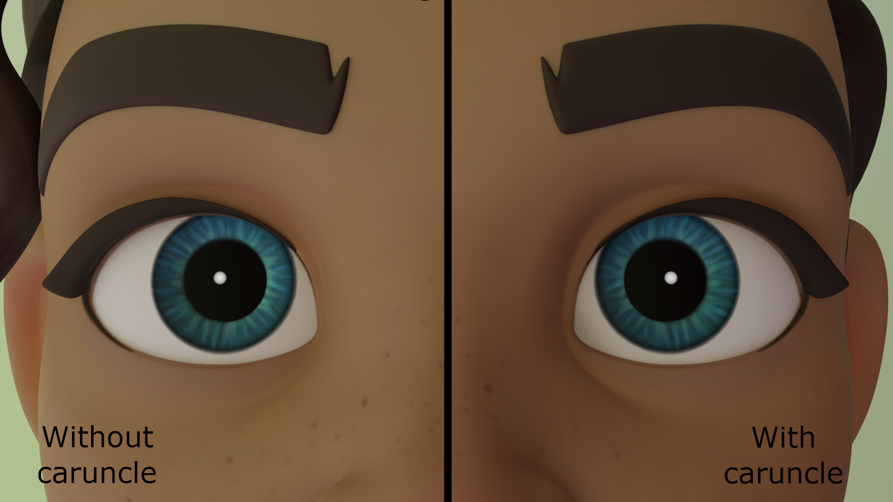

# dynamic-alpha-shader
This repository contains a Python script to generate a dynamic shader object for stylized human character caruncles in the Cycles render engine, compatible with Blender 2.9.0. This add-on allows for simple integration into most projects and existing character armatures. The caruncle object is dynamically shaded based on the character's current eye position and allows for a large degree of customization, in order to ensure control over the final rendered image.

To install and use the add-on, download the file *caruncle_generator.py*, then open Blender and go to its add-on settings. Click the install button and select the downloaded file. After activating the add-on, it can be used at any time by searching for "Caruncle Generator". Apply the caruncle's shrinkwrap modifier to the eye, place the "extreme" reference object to the furthest position from the inner eye that the pupil can be expected to travel, and place the "center" reference object directly over the pupil itself. Finally, parent the caruncle and "extreme" object to the primary head bone and parent the "center" object to the eye or to an equivalent part of the armature.

After this process, the shader should work appropriately. Its exact settings can be specified on creation or edited at any time in a given pipeline prior to rendering through the shading tab.

<h3>Demo</h3>

Rain Rig © Blender Foundation | <a href="http://cloud.blender.org">cloud.blender.org</a>
